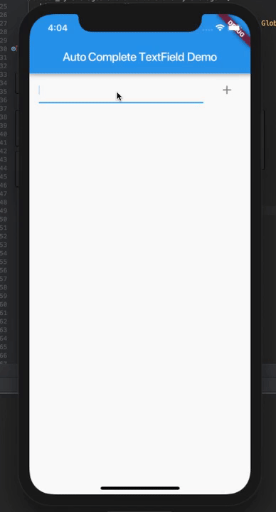

# autocomplete_textfield

An autocomplete textfield for flutter

# pull requests
Feel free to submit pull requests for desired changes / features / bug fixes... It makes the maintenance of this code much easier as I no longer use Flutter frequently.
 
 ## Pub Package Can Be Found At
 
 [Pub Package](https://pub.dartlang.org/packages/autocomplete_textfield#-example-tab-)

 ## Breaking Changes

 TextField is set by default to call onSubmitted on a suggestion tap and also to clear the TextField on submit.

 These can both be disabled with submitOnSuggestionTap and clearOnSubmit respectively.
 
 ## Usage
 
 AutoCompleteTextField supports any data type suggestions
 
 `new AutoCompleteTextField<YOURDATATYPE>()`
 
The suggestions parameter must have data that matches `<YOURDATATYPE>`
 
 A global key of type `GlobalKey<AutoCompleteTextFieldState<T>>` is required so that the `clear()` method can be called to clear AutoCompleteTextField.

# Strings and itemFilter

Filtering is case sensitive so when using strings a common implementation of itemFilter is .   
`
itemFilter: (item, query) {
  return item.toLowerCase().startsWith(query.toLowerCase());
}
`

